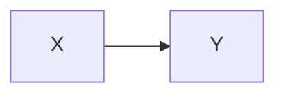
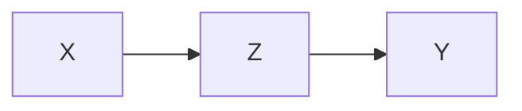

# 뉴런의 모델링
- 인간의 뇌는 계산, 연산, 추론 등 상당히 복합적인 일들을 수행함.
- 모든 작업들이 뉴런들의 결합체인 신경망의 작용에 의해서 이루어짐.
- 컴퓨터는 CPU나 메모리 같은 하드웨어적인 소자들이 존재하여 비슷한 일들을 수행함.

## 뉴런의 기능 모델
- 뉴런은 입력된 외부 자극의 합이 임계 자극보다 큰 경우에만 활성화되는 단순한 기능만을 수행함.
- 다음과 같이 기능적으로 모델링할 수 있음.
- $NET$ = $\sum x$  
	- $x$ : 외부 **입력**
	- $NET$ : 뉴런에 입력되는 **외부 자극의 가중합**
- $y$ $=$ $f (NET)$ 
	- $y$ : 뉴런의 **출력**
	- $f()$ : **활성화 함수** - 뉴런의 활성화 여부를 결정 

### 계단 함수
- $NET$가 임계치 $T$보다 크거나 같으면 뉴런 활성화
- $NET$가 임계치 $T$보다 작으면 뉴런 비활성화

$y=\begin{cases}1, & \mbox{NET >= T} \\0, & \mbox{NET < T}\end{cases}$

## 뉴런의 입력 가중합
- 신경망 모델에 있어 뉴런의 **입력 가중합**이란 각각의 **입력 $x_i$와 연결 강도 $w_i$를** **곱하여 이들을 모두 더한 것**을 말한다.
- $NET = w_1x_1 + w_2x_2 + ... + w_nx_n = \sum_{i=1}^n w_ix_i$ 
- $NET = w^Tx$ 
	- 입력과 연결 강도를 **열벡터**로 표현
	- $w^T$ 는 $w$ 의 치환 벡터
- $NET = xw^T$ 
	- 입력과 연결 강도를 **행벡터**로 표현
	- $w^T$ 는 $w$ 의 치환 벡터

## 뉴런의 출력
- 입력 가중합 $NET$가 임계치 $T$ 보다 크거나 같으면 뉴런이 활성화 됨.
- 입력 가중합 $NET$가 임계치 $T$ 보다 작으면 뉴런이 활성화 되지 않음.
	- 입력: $x_1, x_2$
	- 연결 강도: $w_1, w_2$
	- 입력 가중합: $NET = x_1w_1 + x_2w_2$
	- 출력: $y=f(NET)$

# 신경망의 구조
일반적으로 신경망을 구성하고 있는 **계층의 수**와 **출력 형태**에 따라 구분할 수 있음.
- 계층의 수에 따른 분류
	- 단층 신경망
	- 다층 신경망
- 출력 형태에 따른 분류
	- 순방향 신경망
	- 순환 신경망

## 단층 신경망
- 단층 신경망은 가장 단순한 구조
- 외부 입력을 받아들이는 입력층 $X$, 처리된 결과를 출력하는 출력층 $Y$로 구성됨.

## 다층 신경망
- 다층 신경망은 여러 계층으로 구성된 신경망 구조
- 일반적으로 3계층 구조로 입력층 $X$, 출력층 $Y$, 은닉층 $Z$으로 구성됨.
	- 입력층 $X$: 외부 입력을 받아들이는 계층
	- 출력층 $Y$: 처리된 결과가 출력되는 계층
	- 은닉층 $Z$: 입력층과 출력층 사이에 위치하여 외부로 나타나지 않는 계층
- 다층 신경망의 구조에서는 입력층의 입력에 따라 은닉층의 출력이 나옴.
- 은닉층의 출력은 다시 출력층에 입력되어 최종 출력으로 나오게 됨.

## 순방향 신경망
- 순방향 신경망은 신경망의 출력이 단지 입력에만 관련됨. 
- 신속한 출력을 얻을 수 있는 장점이 있음.
- 문자 인식, 영상 인식, 자동차 주행 제어 등을 비롯하여 거의 대부분의 응용에 사용됨.

## 순환 신경망
- 순환 신경망 구조는 신경망의 출력이 다시 입력 측에 귀환되어 새로운 출력이 나오는 형태.
- 최종 출력을 얻는 데 상당한 시간이 소요됨.
- 연상, 언어 변역, 자연어 처리 등 특정 분야에만 제한적으로 사용됨.

# 신경망의 학습
- 신경망에서 학습이란 특정한 응용 목적에 적합하도록 뉴런 간의 연결 강도를 적응시키는 과정을 말함.

## 지도 학습 (Supervised Learning)
- 1 단계: 응용 목적에 적합한 신경망 구조를 설계
- 2 단계: 연결 강도를 초기화
- 3 단계: 학습 패턴쌍을 입력하여 신경망의 출력을 구함
- 4 단계: 출력과 목표치를 비교하여 오차를 계산
- 5 단계: 오차를 학습 신호 발생기에 입력하여 연결 강도의 변화량을 계산
- 6 단계: 연결 강도를 변경
- 7 단계: 변경된 연결 강도에 대하여 3 ~ 6 단계를 반복
- 8 단계: 더 이상 연결 강도가 변하지 않으면 학습을 종료

## 비지도 학습 (Unsupervised Learning)
- 1 단계: 응용 목적에 적합한 신경망 구조를 설계
- 2 단계: 연결 강도를 초기화
- 3 단계: 학습 패턴을 입력하여 신경망의 출력을 구함
- 4 단계: 츨력을 학습 신호 발생기에 입력하여 연결 강도의 변화량을 계산
- 5 단계: 연결 강도를 변경
- 6 단계: 변경된 연결 강도에 대하여 3 ~ 5 단계를 반복
- 7 단계: 더 이상 연결 강도가 변하지 않으면 학습을 종료

## 연결 강도 변경 메커니즘
- 신경망의 학습은 연결 강도 $w$를 변경시키는 과정임.
- 연결 강도 변화량 $\Delta w$는 학습률 $\eta$, 학습 신호 $\gamma$, 학습 입력 패턴 $x$가 관련됨.
- $\Delta w = \eta \gamma x$ 
- $k + 1$ 단계 학습 과정의 연결 강도는 다음과 같이 표현 가능함.
	- $w^k+1 = w^k + \Delta w$ 