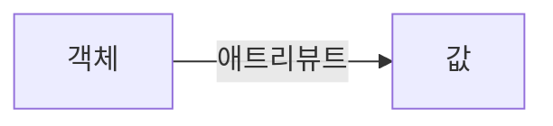
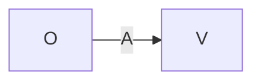
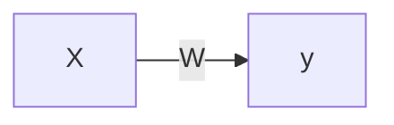

# 패턴 연상
- 연상 작용은 이미 학습을 통해 패턴들의 특징과 관련 정보가 기억되어 있을 때, 어떤 패턴이 입력되면 관련된 가장 밀접한 패턴을 탐색하는 기능임.
- 연상 메모리는 인간 뇌에서의 연상 작용을 신경망 모델을 이용하여 구현한 것임.

## 패턴의 관계형 구조
- 패턴들은 서로 관련성이 있으므로 이들을 관계형 구조로 표현할 수 있음.
- 관계형 구조는 **객체, 애트리뷰트, 값**의 세 항목으로 구성된 순서 세트로 표현할 수 있음.

- 연산 작용이 일어나려면 패턴들 간에 어떤 관련성이 있어야 하며, 애트리뷰트 A가 객체 O와 값 V를 관련 짓는 기능을 하므로 다음과 같은 관계형 구조로 표현 가능함.

- 객체 O와 값 V를 각각 신경망의 입력 패턴 x와 출력 패턴 y라고 하면 애트리뷰트 A는 이들 패턴간의 관계를 기억시킨 신경망 연산 메모리 W라고 간주할 수 있으므로 다음과 같이 표현 가능함.

- 따라서, 연상 메모리 $W$는 입력 패턴 $X$가 들어오면 관련된 출력 패턴 $y$를 연상하는 기능을 하므로 다음과 같은 관계가 성립됨.

$y = XW$

## 연상 메모리의 유형
- 연상 메모리에서는 기억시킬 패턴들의 관련성이 연결 강도에 분산되어 기억됨.
- 검색할 때는 기억된 패턴들 중 입력 패턴과 가장 유사한 패턴이 출력됨.
- 따라서 연상 메모리를 사용하면 부분 입력 패턴이나 오류가 섞인 패턴으로도 원하는 출력 패턴을 얻을 수 있는 장점이 있다.
- 연상 메모리는 관련되는 연상 패턴 쌍의 형태에 따라 **동질 연상 메모리**와 **이질 연상 메모리**로 구분될 수 있음.
	- 동질 연상 메모리: 입력 패턴과 연상될 출력 패턴이 동일한 형태인 연상 메모리를 말함.
	- 이질 연상 메모리: 입력 패턴과 연상될 출력 패턴이 서로 다른 형태인 연상 메모리를 말함.
- 연상 메모리를 구현하는 방법에는 **순방향 구조인 선형 연상 메모리**와 **순환 구조인 순환 연상 메모리** 형태가 있음.
	- 순방향 연상 메모리: 선형 연상 메모리
	- 순환 연상 메모리: Hopfield 모델, 양방향 연상 메모리
- 선형 연상 메모리는 순방향 신경망 구조이므로 어떤 입력에 대해 출력이 나오게 되면 더 이상 연상 작용이 이루어지지 않음.
- 순환 연상 메모리는 어떤 일을 기억해낼 때 연상 작용을 반복함으로써 보다 나은 결과를 얻을 수 있으며, 이러한 순환 개념을 도입한 것을 말함.

기억시킬 입력 패턴: $s = [s_1 s_2 ... s_n]$

연상되는 출력 패턴: $t = [t_1 t_2 ... t_m]$

연결 강도: $W = s^Tt$ 

$$= \begin{bmatrix}s1\\s2\\ \vdots\\s_n\end{bmatrix}[t_1 t_2 ... t_m]$$

$$= \begin{bmatrix}s_1t_1 & s_1t_2 & \cdots & s_1t_m\\ s_2t_1 & s_2t_2 & \cdots & s_2t_m \\ \vdots & \vdots & \vdots & \vdots \\ s_nt_1 & s_nt_2 & \cdots & s_nt_m \end{bmatrix}$$

- $p$개의 패턴쌍들을 저장할 경우의 연결 강도 $W$는 다음과 같음.

$W = W_1 + W_2 + ... + W_p$

$= s^T(1)t(1) + s^T(2)t(2) + ... + s^T(p)t(p)$

$= \sum_{i=1}^p s^T(i)t(i)$

# Hopfield 모델
- Hopfield 모델은 1982년에 J.Hopfield가 제안한 순환 연상 메모리임.

## Hopfield 모델의 구조
Hopfield 모델은 일반적인 순환 연상 메모리와 유사한 구조이지만 다음과 같은 차이가 있음.
- 최종 출력을 얻을 때 까지 외부 입력을 계속 활용함.
- 연결 강도 $W$가 대칭 구조이며, 대각 요소가 0임.

$W_{ij} = W_{ji}$
$W_{ii} = 0$

- 한편 Hopfield 모델은 동질 연상 메모리이므로 기억시킬 입력 패턴 s와 연상되는 출력 패턴이 동일하기 때문에 연결 강도 $W$는 다음과 같이 구할 수 있음.

$W = s^T(i)s(i) - I$

- 따라서 $p$개의 패턴들을 저장하는 연결 강도 $W$는 다음과 같이 구할 수 있음.

$W = \sum_{i=1}^p s^T(i)s(i) -pI$

- 여기서 I는 단위 매트릭스임.