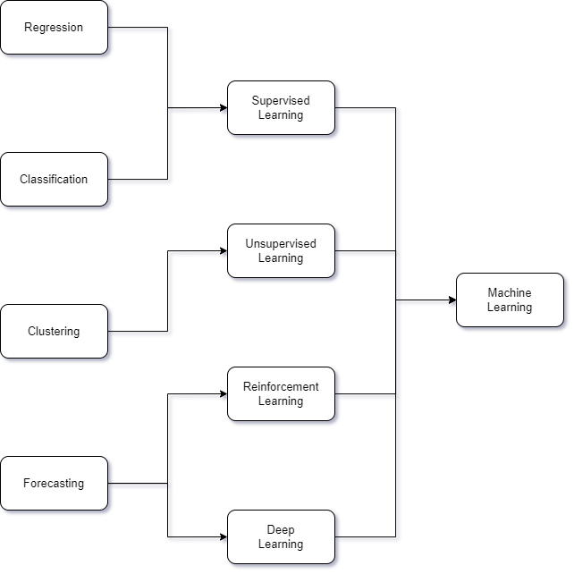

# ML (Machine Learning)

## Reasons for the development of ML

### 1. Classification Problem

- The problem of determining which group to classify when data classified into groups are learned and processed into new data.
- Because it is a problem of determining which group to belong to, the number of groups one can belong to is **finite**, and the predicted value is **ideal**.
- Ex) Prediction model for this year's grades based on student grades from last year

### 2. Regression Problem

- The problem of making predictions when given data that does not deviate significantly from a certain category and the error gradually increases but falls within a certain range.
- Classification problems have **ideal values**, whereas regression problems have **continuous values**.
- Ex) Real estate price prediction model based on year and population

### 3. Clustering Problem

- The problem of easily handling issues related to similarity, such as grouping data with similar characteristics to facilitate analysis or management.
- When classifying a lot of data, rather than classifying by calculating the number of groups the data is grouped into and the average and variance of each group, it is possible to process more macroscopic tasks by classifying only the groups.
- This helps reduce time complexity and simplify the problem itself.

### 4. Forecasting Problem

- A field handled by high-level artificial intelligence, the problem of predicting strategies or values in broad categories.
- Ex) AlphaGo (DeepMind), Weather forecast predicting the weather

## How to learn each problems

### Supervised Learning

- In Regression & Classification problems, there is a **label** that is the correct answer to which group the data belongs to.
- Since the label values for the **train set** are also given, **human-labeled data (= test set)** must be included to obtain the desired results in the following data.

### Unsupervised Learning

- Clustering is a case where labeled data is not required.
- Clustering can be done without additional learning because the data is simply grouped using the similarity of the data without label values.

### Reinforcement Learning

- A method in which the model learns what behavior can be maximized by mathematically modeling a reward system, such as giving a real creature a carrot if it does well and a stick if it does not.

### Deep Learning

- A method of modeling the actual human brain structure and neural network **mathematically and computationally**.
- When a person receives a stimulus during the judgment process, it is actually an electrical signal moving through the brain's neural network.
- A very large number of neurons give output values for each incoming stimulus, and each neuron has a different **weight contributing to the decision**.
- Parts with high involvement have a high weight, and parts with no involvement have a low weight.
- The final output when each weight is subtracted and added and synthesized comprehensively, the structure is structured so that if the final electrical stimulation is above a certain value, action is taken, otherwise no action is taken.
- One neuron is replaced with a computer model called a **Perceptron**, the actual neural network connected to the neurons is called an **ANN (Artificial Neural Network)**, and the model connecting the perceptrons is called an **MLP (Multi Layer Perceptron)**.
- Replacing it with MLP and acting only in response to electrical stimulation above a certain level, it is called an **activation function**, and mathematical modeling in the form of a threshold function is called a **deep learning model**.

